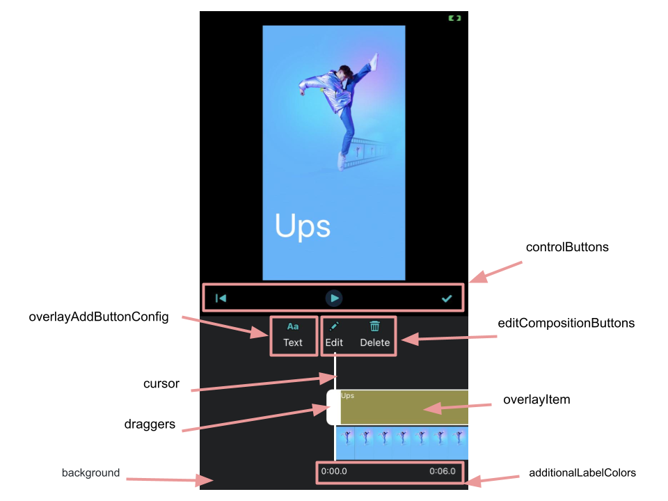
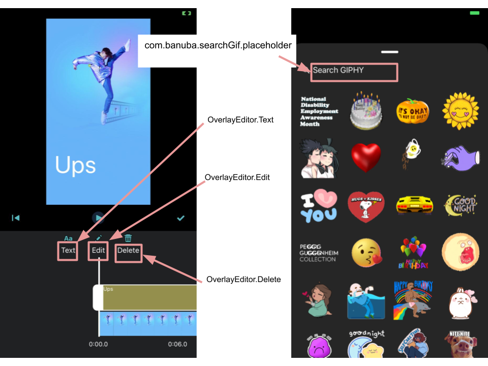

# Banuba VideoEditor SDK
## OverlayEditorConfiguration

The Overlay Editor screen allows you to add text, gifs to your video, as well as adjust the size and position of the added elements.

Below are the configs for customizing the Overlay Editor screen.

- [mainOverlayViewControllerConfig: MainOverlayViewControllerConfig](/Example/Example/Extension/OverlayEditorConfiguration.swift#L10)

MainOverlayViewControllerConfig setups main overlay screen

- [interactivesConfig: InteractivesConfiguration?](/Example/Example/Extension/OverlayEditorConfiguration.swift#L11)

InteractivesConfiguration setups interactive views styles

- var `default`: OverlayEditorConfiguration

Default Configuration

## MainOverlayViewControllerConfig

- [editButtons: [OverlayEditorEditButtonConfig]](/Example/Example/Extension/OverlayEditorConfiguration.swift#L19)

Array of adding buttons

- [editButtonsHeight: CGFloat](/Example/Example/Extension/OverlayEditorConfiguration.swift#L37)

Height for adding buttons' container

- [editButtonsInteritemSpacing: CGFloat](/Example/Example/Extension/OverlayEditorConfiguration.swift#L38)

Spacing between adding buttons

- [editCompositionButtons: [OverlayEditCompositionButtonConfig]](/Example/Example/Extension/OverlayEditorConfiguration.swift#L58)

Array of edit composition buttons

- [controlButtons: [OverlayControlButtonConfig]](/Example/Example/Extension/OverlayEditorConfiguration.swift#L40)

Array of control buttons

- [playerControlsHeight: CGFloat](/Example/Example/Extension/OverlayEditorConfiguration.swift#L78)

Controls container height

- [mainLabelColors: UIColor](/Example/Example/Extension/OverlayEditorConfiguration.swift#L79)

Main labels title color

- [additionalLabelColors: UIColor](/Example/Example/Extension/OverlayEditorConfiguration.swift#L80)

Additional labels title color

- [additionalLabelFonts: UIFont](/Example/Example/Extension/OverlayEditorConfiguration.swift#L81)

Additional labels title font

- [cursorColor: UIColor](/Example/Example/Extension/OverlayEditorConfiguration.swift#L82)

Cursor color

- [audioWaveConfiguration: OverlayItemConfiguration](/Example/Example/Extension/OverlayEditorConfiguration.swift#L83)

OverlayItemConfiguration setups time line items styles

- [resizeImageName: String](/Example/Example/Extension/OverlayEditorConfiguration.swift#L84)

Image name setups resize draggers UIImage

- [draggersHorizontalInset: CGFloat](/Example/Example/Extension/OverlayEditorConfiguration.swift#L85)

Draggers horizontal inset

- [draggersHeight: CGFloat?](/Example/Example/Extension/OverlayEditorConfiguration.swift#L86)

Draggers views' height

- [backgroundConfiguration: BackgroundConfiguration](/Example/Example/Extension/OverlayEditorConfiguration.swift#L87)

BackgroundConfiguration setups background view style

- [playerControlsBackgroundConfiguration: BackgroundConfiguration](/Example/Example/Extension/OverlayEditorConfiguration.swift#L88)

BackgroundConfiguration setups player controls background view style

- [defaultLinesCount: Int](/Example/Example/Extension/OverlayEditorConfiguration.swift#L89)

Default number of time limes

- [timelineCornerRadius: CGFloat](/Example/Example/Extension/OverlayEditorConfiguration.swift#L90)

Time line corner raduis

- [draggerBackgroundColor: UIColor](/Example/Example/Extension/OverlayEditorConfiguration.swift#L91)

Draggers views' background color

- [timeLabelsOffset: CGFloat](/Example/Example/Extension/OverlayEditorConfiguration.swift#L92)

Time labels offset

- [itemsTopOffset: CGFloat](/Example/Example/Extension/OverlayEditorConfiguration.swift#L93)

Top items offset

## TextEditorConfiguration

- [doneButton: RoundedButtonConfiguration](/Example/Example/Extension/OverlayEditorConfiguration.swift#L101)

RoundedButtonConfiguration setups done button style

- [fontButton: RoundedButtonConfiguration](/Example/Example/Extension/OverlayEditorConfiguration.swift#L102)

RoundedButtonConfiguration setups choosing font button style

- [textBackgroundButton: ImageButtonConfiguration](/Example/Example/Extension/OverlayEditorConfiguration.swift#L104)

ImageButtonConfiguration setups filling background color button

- [alignmentImages: [VideoTextAligment: ImageButtonConfiguration]](/Example/Example/Extension/OverlayEditorConfiguration.swift#L111)

Images for aligment states button

- [palette: [VideoTextColorPair]](/Example/Example/Extension/OverlayEditorConfiguration.swift#L117)

Pallete of filling colors

- [fonts: [VideoTextFont]](/Example/Example/Extension/OverlayEditorConfiguration.swift#L128)

Array of text fonts

- [backgroundConfiguration: BackgroundConfiguration](/Example/Example/Extension/OverlayEditorConfiguration.swift#L143)

BackgroundConfiguration setups background view style

- [screenNameConfiguration: ScreenNameConfiguration](/Example/Example/Extension/OverlayEditorConfiguration.swift#L144)

ScreenNameConfiguration setups screen title style

- [palleteInsets: UIEdgeInsets](/Example/Example/Extension/OverlayEditorConfiguration.swift#L145)

Color pallete inset

- [selectionColorBehavior: TextEditSelectionColorBehavior](/Example/Example/Extension/OverlayEditorConfiguration.swift#L147)

 TextEditSelectionColorBehavior setups text editr selection color behavior

- [colorItemConfiguration: TextEditColorItemConfiguration](/Example/Example/Extension/OverlayEditorConfiguration.swift#L152)

TextEditColorItemConfiguration setups pallete's color items' configuration 

- cursorColor: UIColor

Cursor color

## GifPickerConfiguration

- [regularFont: UIFont](/Example/Example/Extension/OverlayEditorConfiguration.swift#L162)

Regular font for controls

- [boldFont: UIFont](/Example/Example/Extension/OverlayEditorConfiguration.swift#L163)

Bold font for controls

- [activityConfiguration: SmallActivityIndicatorConfiguration](/Example/Example/Extension/OverlayEditorConfiguration.swift#L164)

SmallActivityIndicatorConfiguration setups activity indicator style

- [cursorColor: UIColor](/Example/Example/Extension/OverlayEditorConfiguration.swift#L165)

Cursor color

- [giphyAPIKey: String?](/Example/Example/Extension/OverlayEditorConfiguration.swift#L166)

API key to interact with giphy service

## String resources

| Key        |      Value      |   Description |
| ------------- | :----------- | :------------- |
| OverlayEditor.Delete | Delete | Delete overlay item button title
| OverlayEditor.Edit | Edit | Edit overlay item button title
| OverlayEditor.Text | Text | Add text button title
| OverlayEditor.Sticker | Sticker | Add sticker button title
| OverlayEditor.Cancel | Cancel | Cancel button title
| OverlayEditor.Done | Done | Done button title
| OverlayEditor.Yes | Yes | Confirmation button title
| OverlayEditor.No | No | Discarding button title
| OverlayEditor.Do you want to reset all? | Discard changes? | Confirmation message for discarding changes
| Search on giphy.com | Search on giphy.com | Hint, which is shown in the GIF objects search input field, if it is empty
| Cancel | Cancel | Ability to cancel the search for GIF objects
| No stickers found | No stickers found | Pictures not found by custom keyword
| Problems with internet | Problems with internet |A heading showing that there are problems with the Internet connection
| Check your connection and try again | Check your connection and try again | Advice to the user on further actions to solve this problem
| Again | Again | Ability to load GIF objects again
